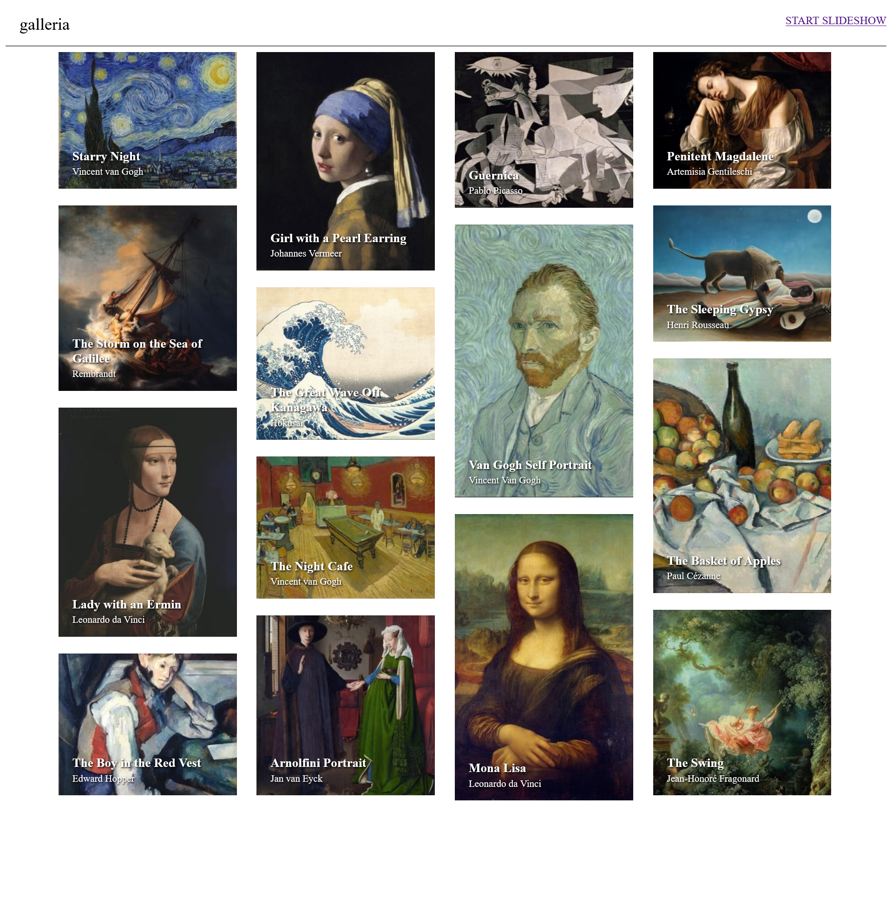

# Frontend Mentor - Galleria slideshow site solution

This is a solution to the [Galleria slideshow site challenge on Frontend Mentor](https://www.frontendmentor.io/challenges/galleria-slideshow-site-tEA4pwsa6). Frontend Mentor challenges help you improve your coding skills by building realistic projects.

## Table of contents

- [Overview](#overview)
  - [The challenge](#the-challenge)
  - [Screenshot](#screenshot)
  - [Links](#links)
- [My process](#my-process)
  - [Built with](#built-with)
  - [What I learned](#what-i-learned)
  - [Continued development](#continued-development)
- [Author](#author)
- [Acknowledgments](#acknowledgments)

## Overview

### The challenge

Users should be able to:

- View the optimal layout for the app depending on their device's screen size
- See hover states for all interactive elements on the page
- Navigate the slideshow and view each painting in a lightbox

### Screenshot

### Links

- Solution URL: [https://www.frontendmentor.io/solutions/galleria-slideshow-T6IWdqj1qV]
- Live Site URL: [https://keithgaines.github.io/galleriaslideshow/]

## My process

In this project, I built a gallery slideshow using a masonry layout on the homepage. Despite not initially knowing what a masonry layout was, I was able to successfully implement it using basic JavaScript and CSS. While I had initially planned to use React, I encountered some difficulties with routing to each slide, so I switched gears and opted for a simpler approach. Overall, I was able to achieve the desired design and functionality for the project.

### Built with

- Semantic HTML5 markup
- CSS custom properties
- Mobile-first workflow
- JavaScript

### What I learned

In this project, I challenged myself to build a gallery slideshow using a masonry layout on the homepage. This was a new concept for me, so I had to research how to implement it using CSS. I initially planned to use React but ran into issues with routing to each slide, so I decided to switch to basic JavaScript instead.

Throughout the project, I gained a deeper understanding of how to create interactive components for web development using JavaScript. I also learned how to troubleshoot issues that arose during the development process, such as the routing issue that I encountered. Overall, I was able to achieve the desired design and functionality for the project, and I am excited to apply the skills and knowledge that I gained in future projects.

### Continued development

Through this project, I gained valuable experience in implementing a masonry layout, building a gallery slideshow, and troubleshooting issues that arose during the development process. Moving forward, I plan to continue expanding my skillset and knowledge base in web development, with a particular focus on mastering React and other popular front-end frameworks.

I also plan to improve my understanding of back-end development, including server-side languages and databases. Additionally, I am committed to staying up-to-date with the latest web development trends and best practices, as well as continuing to learn and grow as a developer.

Overall, I am excited to continue developing my skills and expertise in web development and to take on new challenges and projects in the future.

## Author

- Website - [Keith Gaines](https://keithgaines.github.io)
- Frontend Mentor - [@keithgaines](https://www.frontendmentor.io/profile/keithgaines)

## Acknowledgments

Shoutout to Google, and StackOverflow. This was definitely one of the more difficult projects I've done in my career up until now, but Google and StackOverflow were there with documentation to help me figure it out. 
